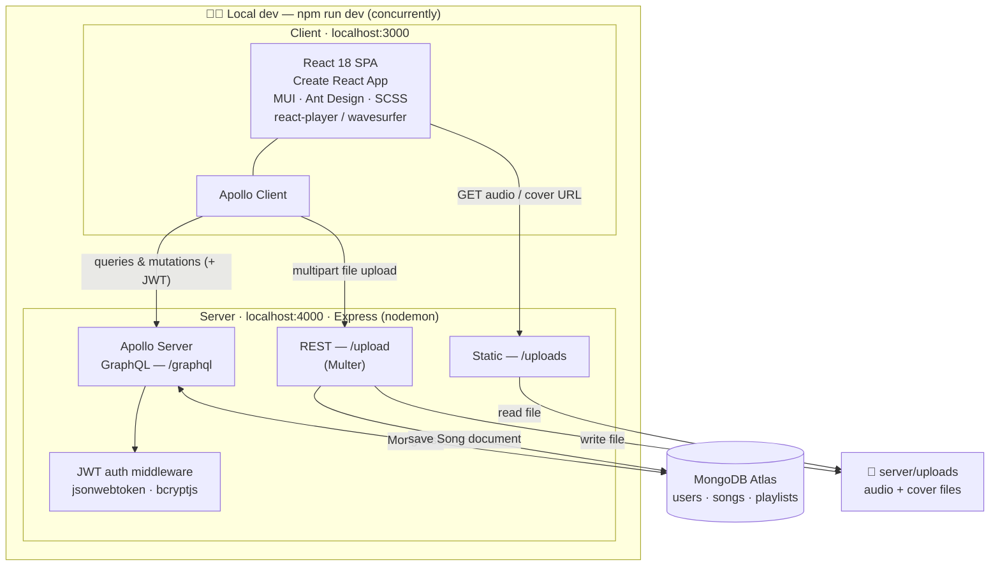

<div align="center">

# 🎵 Soundify

**A full-stack music streaming app — a SoundCloud-style clone.**

Create an account, upload your own tracks, browse by genre, build playlists, and comment on songs — with a persistent audio player that follows you across every page.


</div>

---

## Overview

Soundify is a [MERN](https://www.mongodb.com/mern-stack) application (MongoDB, Express, React, Node) with a GraphQL API. Users register and log in, upload audio files with cover art, search by song or artist, organize tracks into playlists, and leave comments. A bottom-docked audio player keeps playing as you navigate.

> Originally built in 2022 as a five-person group project, since revived to run on a modern Node toolchain with MongoDB Atlas and local-disk file storage.

## Features

- 🔐 **Authentication** — register / log in, with JWT sessions and bcrypt-hashed passwords
- ⬆️ **Uploads** — add songs with title, artist, genre, and cover art
- 🔎 **Search & browse** — find tracks by title or artist, or explore by genre
- 🎧 **Persistent player** — playback continues across page navigation (waveform + spectrum visualizers)
- 📂 **Playlists** — group songs and play through them
- 💬 **Comments** — discuss individual tracks

## Screenshots

| Landing | Dashboard |
|---|---|
|  |  |

| Upload | Song detail |
|---|---|
|  |  |

## Architecture

The app runs as two processes in development, launched together by `npm run dev`. The React client talks to a single Express server that exposes **GraphQL** for structured data and a small **REST** surface for binary file uploads. Data lives in **MongoDB Atlas**; uploaded files live on **local disk** and are served back as static URLs.



**Why two API styles?** GraphQL handles all structured data cleanly, but it isn't well-suited to raw binary file uploads — so song/cover uploads use a dedicated REST endpoint (`/upload`) with Multer, and the resulting files are served statically from `/uploads`.

## Tech Stack

| Layer | Tools |
|---|---|
| **Client** | React 18, Create React App, Apollo Client, MUI, Ant Design, styled-components / SCSS, react-router, react-player, wavesurfer.js |
| **Server** | Node.js, Express, Apollo Server (GraphQL), Multer |
| **Database** | MongoDB Atlas via Mongoose |
| **Auth** | JSON Web Tokens, bcryptjs |
| **Storage** | Local disk (`server/uploads`), served via Express static |
| **Dev tooling** | concurrently, nodemon |

## Getting Started

### Prerequisites

- **Node.js 18+** (an `.nvmrc` pins 18; Node 22 also works) — `nvm use`
- A **MongoDB Atlas** connection string (free tier is fine)

### 1. Install

```bash
git clone https://github.com/calvin-kim13/Soundify.git
cd Soundify
npm run install   # installs both server and client dependencies
```

### 2. Configure environment

Copy the example and fill in your values:

```bash
cp server/.env.example server/.env
```

| Variable | Description |
|---|---|
| `MONGO_URL` | MongoDB Atlas connection string |
| `JWT_SECRET` | Secret for signing tokens — generate with `node -e "console.log(require('crypto').randomBytes(48).toString('hex'))"` |
| `PORT` | API server port (default `4000`) |
| `SERVER_URL` | *(optional)* base URL used to build file links; defaults to `http://localhost:PORT` |

### 3. Run

```bash
npm run dev
```

- Client → http://localhost:3000
- GraphQL API → http://localhost:4000/graphql

## Project Structure

```
Soundify/
├── client/                 # React SPA (Create React App)
│   └── src/
│       ├── components/      # UI + audio player
│       ├── pages/           # routed views (Login, Dashboard, Playlists, …)
│       └── utils/           # Apollo queries, mutations, hooks
└── server/                 # Express + Apollo backend
    ├── schema/             # GraphQL typeDefs + resolvers
    ├── models/             # Mongoose models (User, Songs, Playlists)
    ├── routes/             # REST routes (file upload, etc.)
    ├── S3Service/          # file-storage layer (local disk)
    ├── utils/              # JWT auth middleware
    └── uploads/            # uploaded files (gitignored, created at runtime)
```

## How It Works

**Register / log in**
> Client sends a GraphQL mutation → resolver hashes/verifies the password (bcrypt) → signs a JWT → client stores it in `localStorage` and attaches it as the `Authorization` header → the auth middleware verifies it on each request.

**Upload a song**
> Client POSTs a multipart form to `/upload` → Multer reads the file into memory → the storage layer writes it to `server/uploads/` → a `Song` document is created in MongoDB and linked to the user.

**Browse & play**
> Client runs the `allSongs` GraphQL query → receives song documents whose `link` points at `/uploads/...` → the audio player streams the file directly.

## Authors

- Marcus Lewis
- Calvin Kim
- Jason Yoo
- Tyler Welker
- Brett Hockridge

## License

ISC
